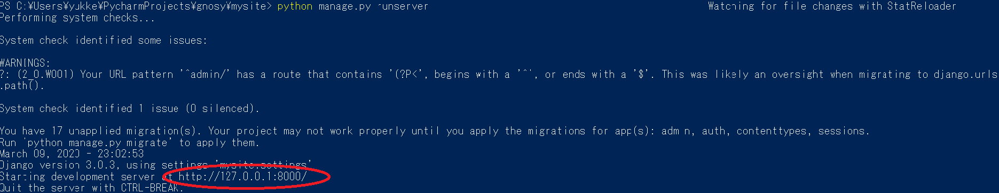

# メールフィルタ
このリポジトリは、メールをスパムメールか否かを分類してくれる、教師付き分類機webアプリケーションである。

### 概要

このメールフィルタはナイーブベイズを使用したもので、使用するデータベースとメール本文を入力すると、ラベルを返すものである。

ラベルは、「N」「S」の二つ。(N=Not spam, S=Spam)


### 実行要件

python 3.6 以上

Djangoo 1.11.11 以上

mecab 0.996 以上

下記のコードでパッケージをダウンロードできる。


`pip install -r request/requirements.txt`


### 文法

```bash
$ python manage.py runservere
```


### デモ



実行すると上の画像のようなものが現れるので、"'赤丸内のアドレス'/categorization/mailfilter"をwebで検索すると、


このようなものが出てくる。
ここで、教師データベース([詳細](https://github.com/yusuke1565/Mail_filter/tree/master/make_db))と、メール本文を入力すると、


結果が返ってくる。
