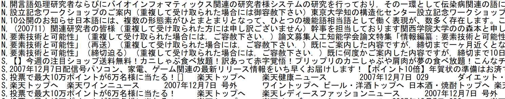

# 教師データの作成

ここでは教師データ作成について記す。

### 概要

教師データは、make_db_mail_filter.py にテキストデータを読み込ませることによって作成される。

### 文法

'''bash
$ python make_db_mail_filter.py <-.txt> <-.db>
'''

`<-.txt>`は、事前に用意したデータである。
`<-.db>`は、作成されるデータベースの名前を決めれる。
実行すると、<-.db> が作成される。
(新しくデータベースを作成した場合は、form.html(./myapp/templates/myapp/form.html)を書き換えてください)

### テキストデータ

今回事前に用意したデータについて説明する。

上記のように、`<ラベル>,<本文>`　のようになっている。
(ここのラベルを変えれば、多種多様に変更できる。)

### 精度向上にむけて

今回精度向上に向けて取り組んだ。
新しく、new_make_db_mail_filter.pyを作成し、教師データの改善に取り組んだ。
改善点は、「全ラベルに、それぞれ10回以上出現したものは確率を計算する前に削除する。」というものだ。
今回この改善を施した理由は、メールにおいて上記の条件に合うものは、どのメールにも含まれる言葉（代名詞など）が判別するのに不要なものだと思ったからだ。さらにそれらが他の、判別するのに必要な単語の確率を大幅に下げてしまうのではないか、と考えた。
新しく作成したデータベースが、[database/new_training_mail_filter.db](https://github.com/yusuke1565/Mail_filter/tree/master/database)である。
